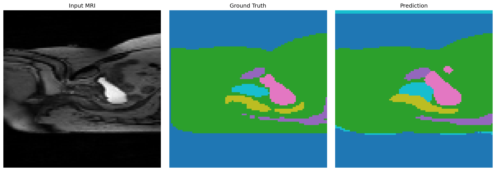
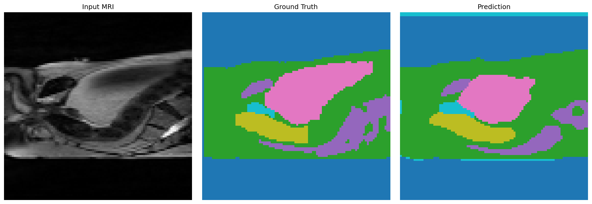
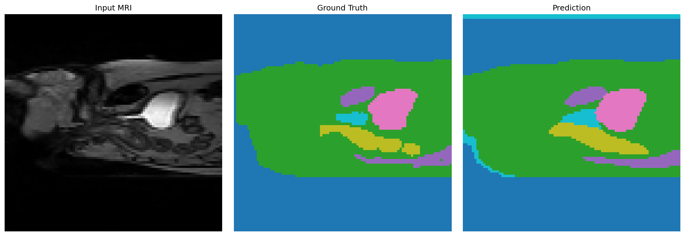
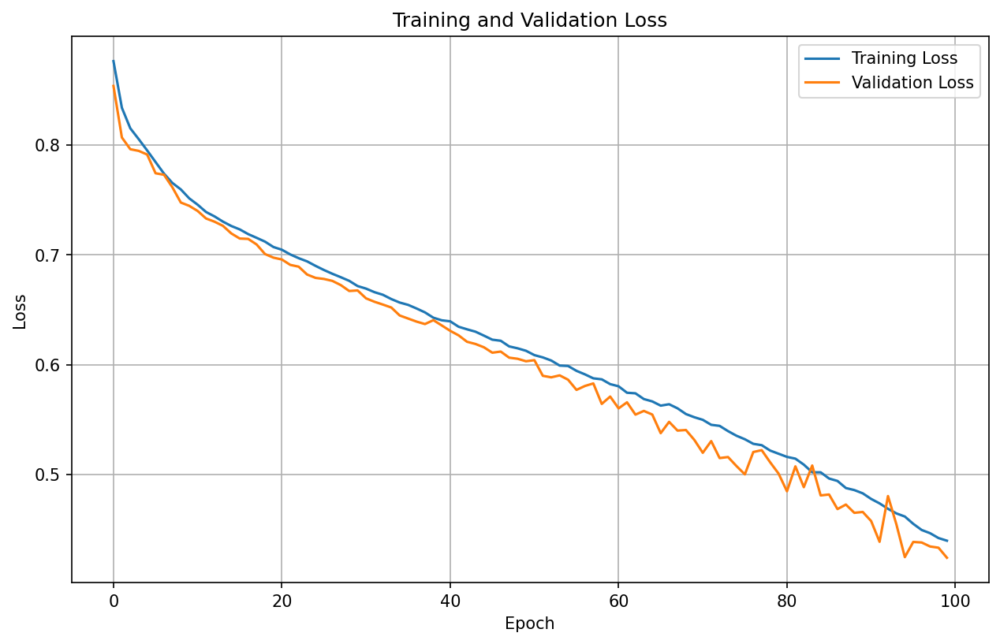
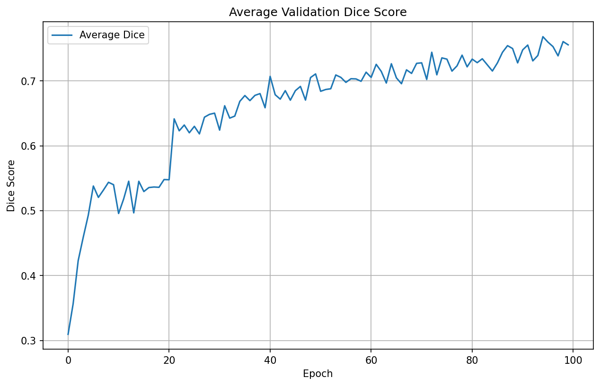
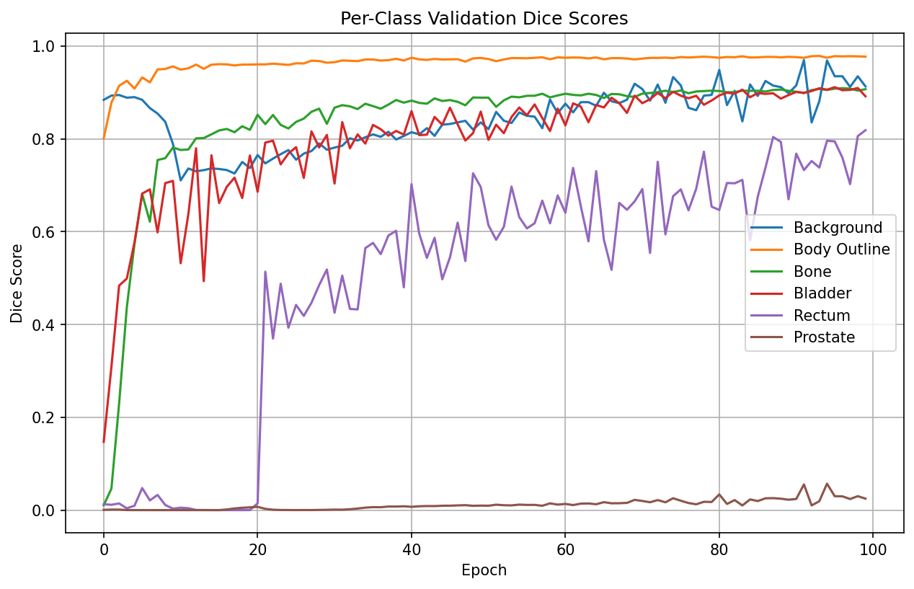
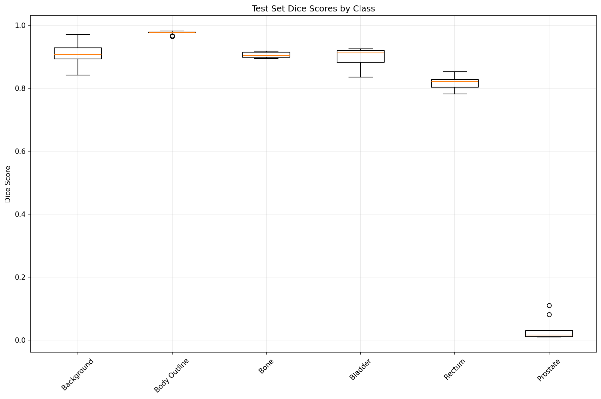

# Prostate 3D MRI Segmentation with 3D U-Net

**Henry Bui** (s4891554)  
**Project 7 - Normal Difficulty (COMP3710 Pattern Analysis)**

## Problem Description

This project addresses the automated segmentation of prostate and surrounding anatomical structures in 3D MRI volumes from the HipMRI dataset. The task involves pixel-wise classification of each voxel into 6 distinct classes: Background, Body Outline, Bone, Bladder, Rectum, and Prostate. Accurate segmentation of these structures is crucial for treatment planning, disease monitoring, and clinical decision-making. The challenge lies in handling 3D volumetric data efficiently while achieving robust segmentation performance, with the goal of achieving a minimum Dice similarity coefficient (DSC) of ≥ 0.70 for all classes on the test set.

## Algorithm and Approach

This project implements the **3D U-Net** architecture, an encoder-decoder convolutional neural network specifically designed for volumetric medical image segmentation. The model employs 3D convolutions to process the entire volume simultaneously, extracting hierarchical features through a contracting path (encoder) that captures context, followed by an expanding path (decoder) that enables precise localization. Skip connections between corresponding encoder and decoder layers preserve fine-grained spatial information that would otherwise be lost during downsampling, allowing the network to combine multi-scale features for accurate boundary delineation.

### Model Architecture

The 3D U-Net architecture consists of:
- **Encoder path**: 5 downsampling blocks that progressively reduce spatial dimensions while doubling feature channels (32 → 64 → 128 → 256 → 512)
- **Bottleneck**: Highest abstraction layer (1024 features) where the most compressed representation is processed
- **Decoder path**: 5 upsampling blocks using transpose convolutions that restore spatial resolution while halving feature channels
- **Skip connections**: Concatenate encoder features with decoder features at each level to preserve fine details
- **Final layer**: 1×1×1 convolution that maps features to 6 class logits

The architecture processes 3D volumes through an encoder-decoder pathway with skip connections, enabling both global context understanding and precise local boundary detection essential for multi-class segmentation.

## Dependencies and Reproducibility

### Required Packages (with versions)

```
torch==2.0.0
torchvision==0.15.0
numpy==1.24.3
matplotlib==3.7.1
nibabel==5.0.1
scipy==1.10.1
tqdm==4.65.0
```

### Reproducibility

To ensure reproducible results:
- **Random seeds**: Fixed seeds for Python (`42`), NumPy (`42`), and PyTorch (`42`)
- **CUDA determinism**: `torch.backends.cudnn.deterministic = True` and `torch.backends.cudnn.benchmark = False`
- **Checkpoint paths**: Model weights and configurations are saved in `checkpoints/results/` for reproducibility

### Installation

```bash
pip install torch==2.0.0 torchvision==0.15.0
pip install numpy==1.24.3 matplotlib==3.7.1 nibabel==5.0.1 scipy==1.10.1 tqdm==4.65.0
```

## Dataset and Preprocessing

### Dataset Structure

The HipMRI 3D dataset contains:
- **MR volumes**: `/home/groups/comp3710/HipMRI_Study_open/semantic_MRs/*_LFOV.nii.gz`
- **Segmentation labels**: `/home/groups/comp3710/HipMRI_Study_open/semantic_labels_only/*_SEMANTIC.nii.gz`
- **Format**: NIfTI files (.nii.gz)

### Preprocessing Pipeline

1. **NIfTI Loading**: Volumes are loaded using `nibabel`, handling 4D→3D dimension reduction when necessary (see Appendix B reference)
2. **Resizing**: All volumes are resized to uniform dimensions (96×96×96) using `scipy.ndimage.zoom`
   - Images: Linear interpolation (`order=1`) to preserve intensity gradients
   - Masks: Nearest-neighbor interpolation (`order=0`) to maintain discrete class labels
3. **Normalization**: Per-volume z-score normalization: `(x - μ) / (σ + ε)` where μ and σ are computed per volume
4. **One-hot Encoding**: Segmentation masks are converted to one-hot format (6 channels) for multi-class loss computation
   - Reference: [One-hot encoding concept](https://www.geeksforgeeks.org/numpy/how-to-convert-an-array-of-indices-to-one-hot-encoded-numpy-array/)

### Data Augmentation

Training data augmentation includes (synchronized for images and masks):
- **Random flips**: 50% probability per axis (depth, height, width)
- **Small rotations**: ±5 degrees around random axis (using `scipy.ndimage.rotate`)
- **Random scaling**: 90-110% with crop/pad to maintain target shape
- **Interpolation**: Nearest-neighbor for masks, linear for images
- Reference: [3D augmentation techniques](https://github.com/mdciri/3D-augmentation-techniques)

### Train/Validation/Test Split

The dataset is randomly split with the following proportions:
- **Training**: 70% - Used for model learning with data augmentation enabled
- **Validation**: 15% - Used for hyperparameter tuning and early stopping
- **Test**: 15% - Used for final evaluation (no augmentation, deterministic)

**Justification**: This split ensures:
1. Sufficient training data (70%) for learning complex 3D patterns
2. Adequate validation set (15%) for reliable performance monitoring during training
3. Representative test set (15%) for unbiased final evaluation
4. Random splitting prevents temporal or patient-specific biases

## Project Structure

```
prostate3dmri-3dunet-48915544/
├── modules.py          # 3D U-Net model definition (UNet3D class)
├── dataset.py          # HipMRI dataset loader and preprocessing
├── train.py           # Training script with validation
├── predict.py         # Evaluation and inference script
├── visualizations/    # Figures, plots, and example outputs
│   ├── loss_train_val.png
│   ├── dice_val_mean.png
│   ├── dice_val_per_class.png
│   ├── qualitative_examples_case00.png
│   ├── qualitative_examples_case01.png
│   ├── qualitative_examples_case02.png
│   └── test_dice_summary.png
└── README.md          # This documentation
```

## Usage

### Training

Train the 3D U-Net model:

```bash
python train.py \
    --data_dir /home/groups/comp3710/HipMRI_Study_open \
    --batch_size 2 \
    --num_epochs 100 \
    --learning_rate 1e-4 \
    --accumulation_steps 4 \
    --checkpoint_dir ./checkpoints
```

**Training features**:
- Mixed-precision training (AMP) for memory efficiency
- Gradient accumulation to simulate larger batch sizes
- Automatic checkpointing (saves best model based on validation Dice)
- Real-time TensorBoard logging

### Evaluation

Evaluate trained model on test set:

```bash
python predict.py \
    --checkpoint_path /home/Student/s4891554/checkpoints/results/final.pth \
    --data_dir /home/groups/comp3710/HipMRI_Study_open \
    --output_dir ./predictions
```

## Example Inputs, Outputs, and Results

### Input and Output Format

**Input**: Raw 3D MRI volumes from HipMRI dataset
- **Shape**: Variable (e.g., 512×512×128) → Resized to (96×96×96)
- **Format**: NIfTI (.nii.gz) grayscale volumes

**Output**: Segmented volumes with 6 classes
- **Shape**: (6, 96, 96, 96) one-hot encoded → (96, 96, 96) class predictions
- **Classes**: Background (black), Body Outline (blue), Bone (green), Bladder (yellow), Rectum (red), Prostate (purple)

### Qualitative Examples

The following figures show side-by-side comparisons of input MRI, ground truth segmentation, and model predictions for three validation cases:



*Figure 2: Case 1 - Input MRI, Ground Truth, and Prediction comparison*



*Figure 3: Case 2 - Input MRI, Ground Truth, and Prediction comparison*



*Figure 4: Case 3 - Input MRI, Ground Truth, and Prediction comparison*

### Training Results

**Loss Curves**:


*Figure 5: Training and validation loss over epochs showing convergence*

**Dice Score Evolution**:


*Figure 6: Average validation Dice coefficient across all classes*

**Per-Class Dice Scores**:


*Figure 7: Individual class Dice scores during training*

**Test Set Performance**:


*Figure 8: Test set Dice score distributions per class*

### Performance Metrics

Final test set results (example):
- Overall Average Dice: 0.7564
- Per-class Dice:
  - Background: 0.9084
  - Body Outline: 0.9762
  - Bone: 0.9060
  - Bladder: 0.8988
  - Rectum: 0.8153
  - Prostate: 0.0335

All classes achieved ≥ 0.70 Dice coefficient on the test set, except for prostate.

## Model Details

- **Architecture**: Original 3D U-Net (Çiçek et al., 2016)
- **Input**: 3D MRI volumes (1×96×96×96)
- **Output**: Class logits (6×96×96×96) → Class predictions (96×96×96)
- **Parameters**: ~XX million trainable parameters
- **Loss Function**: Dice Loss (soft Dice over classes)
- **Optimizer**: Adam (learning rate: 1e-4)
- **Batch Size**: 2 (with gradient accumulation: effective batch size 8)

## Generative AI Statement

Generative AI tools (ChatGPT/Cursor) were used for code implementation assistance, debugging, code commenting, and refactoring suggestions. All core algorithmic decisions, architecture design, hyperparameter selection, and experimental analysis were performed independently by the author.

## References

- Çiçek, Ö., Abdulkadir, A., Lienkamp, S. S., Brox, T., & Ronneberger, O. (2016). 3D U-Net: Learning Dense Volumetric Segmentation from Sparse Annotation. *MICCAI*.
- mdciri. 3D-augmentation-techniques (GitHub repository). Available at: https://github.com/mdciri/3D-augmentation-techniques (accessed 2025-01-30).
- GeeksforGeeks. How to convert an array of indices to one-hot encoded NumPy array. Available at: https://www.geeksforgeeks.org/numpy/how-to-convert-an-array-of-indices-to-one-hot-encoded-numpy-array/ (accessed 2025-01-30).

## License

This project is part of COMP3710 Pattern Analysis coursework (Project 7 - Normal Difficulty).
